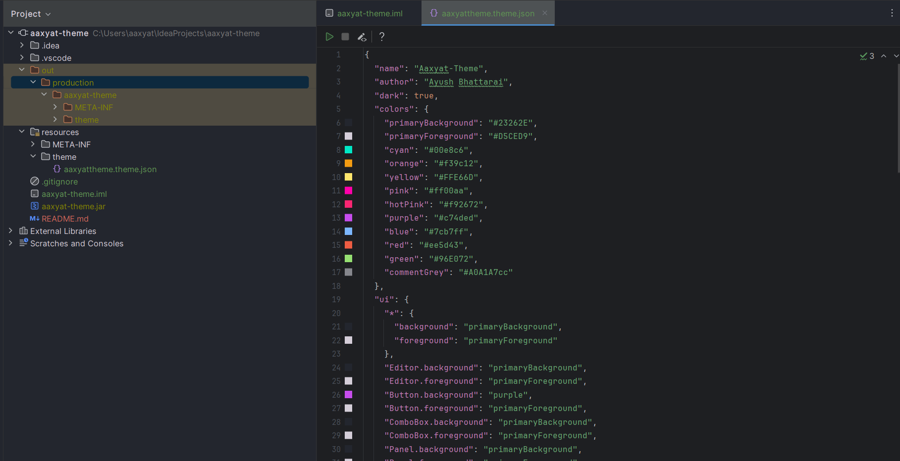

# Aaxyat Theme 🌌

A meticulously crafted dark theme for JetBrains IDEs, inspired by the cosmic beauty of Andromeda. This theme combines deep space-inspired colors with carefully selected contrasts to provide an exceptional coding experience.

## 🎨 Features

- **Cosmic Color Palette**: Deep, space-inspired colors optimized for long coding sessions
- **Enhanced Readability**: Carefully selected contrast ratios for reduced eye strain
- **Beautiful Syntax**: Thoughtfully chosen colors for syntax highlighting
- **Cross-IDE Support**: Works seamlessly across multiple JetBrains IDEs
- **Modern UI**: Polished interface elements with attention to detail

## 🚀 Supported IDEs

- IntelliJ IDEA
- PyCharm
- WebStorm
- DataGrip
- Other IntelliJ-based IDEs

## 📥 Installation

1. Open your JetBrains IDE
2. Go to `Settings/Preferences → Plugins`
3. Click on `Browse repositories...`
4. Search for "Aaxyat Theme"
5. Click `Install`
6. Restart your IDE
7. Go to `Settings/Preferences → Appearance & Behavior → Appearance`
8. Select "Aaxyat Theme" from the theme dropdown

## 🎯 Color Palette

| Color Purpose | Hex Code | Preview |
|--------------|----------|----------|
| Background   | `#23262E` |  |
| Foreground   | `#D5CED9` |  |
| Cyan         | `#00e8c6` |  |
| Orange       | `#f39c12` |  |
| Purple       | `#c74ded` |  |
| Pink         | `#ff00aa` |  |

## 🛠 Development

Want to contribute? Great! Here's how you can help:

1. Fork the repository
2. Create a new branch (`git checkout -b feature/amazing-feature`)
3. Make your changes
4. Commit your changes (`git commit -m 'Add some amazing feature'`)
5. Push to the branch (`git push origin feature/amazing-feature`)
6. Open a Pull Request

## 📝 License

This project is licensed under the MIT License - see the [LICENSE](LICENSE) file for details.

## 👨‍💻 Author

**Ayush Bhattarai**
- Website: [ayushb.com](https://www.ayushb.com)
- GitHub: [@aaxyat](https://github.com/aaxyat)

## 🙏 Acknowledgments

- Inspired by the Andromeda color scheme
- Built with love for the developer community
- Special thanks to all contributors

---

If you like this theme, please consider giving it a ⭐️ on GitHub and rating it in the JetBrains Marketplace!
